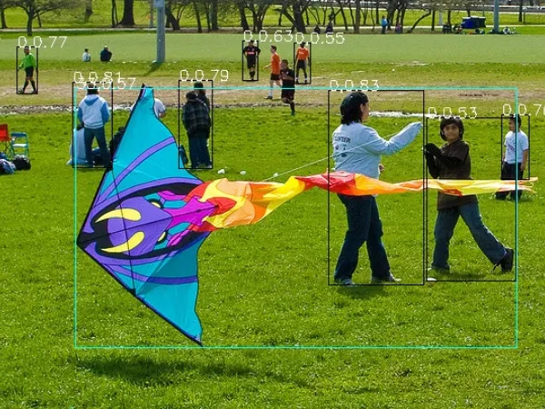
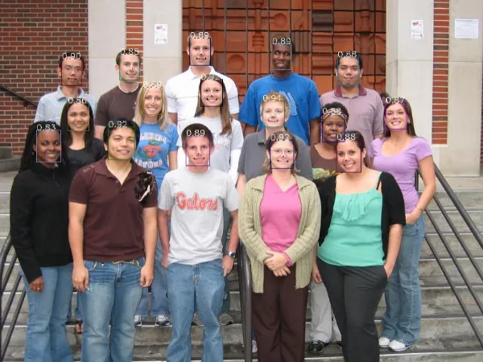
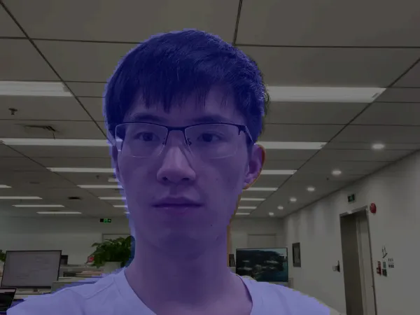

# AI Deployment on RK3588 with PaddlePaddle FastDeploy

## Introduction

**FastDeploy** is an Easy-to-use and High Performance AI model deployment toolkit for Cloud, Mobile and Edge with out-of-the-box and unified experience. It provides end-to-end optimization for over 150+ Text, Vision, Speech and Cross-modal AI models.

**Key Features:**
*   **Tasks:** Image classification, object detection, image segmentation, face detection/recognition, keypoint detection, matting, OCR, NLP, TTS, etc.
*   **Hardware:** Currently supports `rknpu2` to run AI models on **RK3588**.
*   **Goal:** Meet developers' industrial deployment needs for multi-scenario, multi-hardware and multi-platform.

> **Note:** For the detailed support list and latest progress, please visit the [https://github.com/PaddlePaddle/FastDeploy](https://github.com/PaddlePaddle/FastDeploy).

---

## On RK3588 (Target Device)

### Compilation and Installation

**Prerequisites:**
*   **Firmware:** Based on RK3588 Firefly Ubuntu 20.04 v1.0.4a.
*   **Python:** Compiling with Python 3.8.
*   **Driver:** Firmware comes with `rknpu2` v1.4.0 (Installation skipped).

> **Important:** If you need C++ compilation or manual `rknpu2` installation, please refer to the [https://github.com/rockchip-linux/rknpu2/tree/master/doc](https://github.com/rockchip-linux/rknpu2/tree/master/doc).

#### Preparation
Run the following commands to install dependencies:

```bash
sudo apt update
sudo apt install -y python3 python3-dev python3-pip gcc python3-opencv python3-numpy
```

#### Installation Options

You have two options to install FastDeploy:

**Option A: Use Pre-built Package (Quick Start)**
We offer a pre-built Python wheel for fast deployment.
*   **Download:** [Google Drive Link](https://drive.google.com/drive/folders/110zBB51npTFMFKl81wVrFsj2WZXa4GAL?usp=sharing)
*   **Version:** Based on FastDeploy v1.0.0 (commit id `c4bb83ee`).

> **Warning:** This project is updated very frequently. The pre-built wheel here may be outdated. It is recommended for quick understanding and testing only. For development and deployment, please build from the latest source.

**Option B: Building from Source (Recommended)**
If your RK3588 has insufficient RAM, an OOM error may occur. You can add `-j N` after the build command to control jobs.

```bash
sudo apt update
sudo apt install -y gcc cmake

# Clone repository
git clone https://github.com/PaddlePaddle/FastDeploy.git
cd FastDeploy/python

# Set environment variables
export ENABLE_ORT_BACKEND=ON
export ENABLE_RKNPU2_BACKEND=ON
export ENABLE_VISION=ON
export RKNN2_TARGET_SOC=RK3588

# Build and Package
python3 setup.py build
python3 setup.py bdist_wheel
```

#### Installation
Find the `.whl` file under `FastDeploy/python/dist` (or use the pre-built one) and install via pip:

```bash
pip3 install fastdeploy_python-*-linux_aarch64.whl
```

---

### Inference Demos

Here are 3 tuned demos available for testing.
*   **Download Demos:** [Google Drive Link](https://drive.google.com/drive/folders/110zBB51npTFMFKl81wVrFsj2WZXa4GAL?usp=sharing)

> **Warning:** Similar to the pre-built package, these demos may be outdated. For development, please get the latest models from the official GitHub.

**Decompress and run the following examples:**

#### Picodet Object Detection
```bash
cd demos/vision/detection/paddledetection/rknpu2/python

python3 infer.py \
  --model_file ./picodet_s_416_coco_lcnet/picodet_s_416_coco_lcnet_rk3588.rknn \
  --config_file ./picodet_s_416_coco_lcnet/infer_cfg.yml \
  --image 000000014439.jpg
```

#### SCRFD Face Detection
```bash
cd demos/vision/facedet/scrfd/rknpu2/python

python3 infer.py \
  --model_file ./scrfd_500m_bnkps_shape640x640_rk3588.rknn \
  --image test_lite_face_detector_3.jpg
```

#### PaddleSeg Portrait Segmentation
```bash
cd demos/vision/segmentation/paddleseg/rknpu2/python

python3 infer.py \
  --model_file ./Portrait_PP_HumanSegV2_Lite_256x144_infer/Portrait_PP_HumanSegV2_Lite_256x144_infer_rk3588.rknn \
  --config_file ./Portrait_PP_HumanSegV2_Lite_256x144_infer/deploy.yaml \
  --image images/portrait_heng.jpg
```

---

## On PC (Host Environment)

In the previous chapter, only the running environment was deployed on RK3588. Model conversion and parameter adjustments need to be done on the PC. Therefore, FastDeploy must also be installed on the x86_64 Linux PC.

### Compilation and Installation

**Requirements:**
| Component | Requirement |
| :--- | :--- |
| **OS** | Ubuntu 18.04 or above |
| **Python** | 3.6 or 3.8 |

#### Install rknn-toolkit2
It is recommended to use `conda` or `virtualenv` to create a virtual environment.

1.  **Download:** Get the `rknn_toolkit2` wheel from [https://github.com/airockchip/rknn-toolkit2/tree/master/rknn-toolkit2/packages](https://github.com/airockchip/rknn-toolkit2/tree/master/rknn-toolkit2/packages).
2.  **Install Dependencies:**
    ```bash
    sudo apt install -y libxslt1-dev zlib1g zlib1g-dev libglib2.0-0 libsm6 libgl1-mesa-glx libprotobuf-dev gcc g++
    ```
3.  **Setup Environment:**
    ```bash
    # Create virtual env
    conda create -n rknn2 python=3.6
    conda activate rknn2

    # rknn_toolkit2 needs specific numpy version
    pip3 install numpy==1.16.6

    # Install rknn_toolkit2
    pip3 install rknn_toolkit2-1.4.0-*cp36*-linux_x86_64.whl
    ```

#### Build and Install FastDeploy
```bash
pip3 install wheel
sudo apt install -y cmake

git clone https://github.com/PaddlePaddle/FastDeploy.git
cd FastDeploy/python

# Set environment variables
export ENABLE_ORT_BACKEND=ON
export ENABLE_PADDLE_BACKEND=ON
export ENABLE_OPENVINO_BACKEND=ON
export ENABLE_VISION=ON
export ENABLE_TEXT=ON

# OPENCV_DIRECTORY is optional (downloads pre-built OpenCV if empty)
export OPENCV_DIRECTORY=/usr/lib/x86_64-linux-gnu/cmake/opencv4

# Build and Install
python setup.py build
python setup.py bdist_wheel
pip3 install dist/fastdeploy_python-*-linux_x86_64.whl
pip3 install paddlepaddle
```

### Examples and Tutorial
Many examples are located under `FastDeploy/examples`. Tutorials can be found in the `README.md` in every directory level.

---

## Algorithm Performance Results

### PicoDet_S Object Detection Model


### SCRFD Face Detection Model


### Portrait-PP-HumanSegV2_Lite Portrait Segmentation Model

